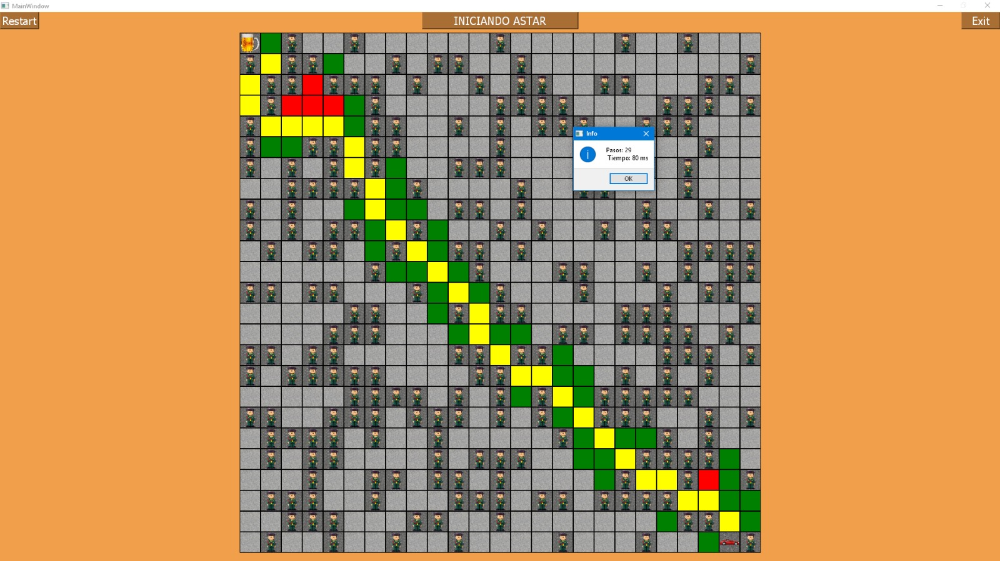

# Inteligencia Artifical - Búsqueda

## Objetivo

El objetivo de esta práctica consiste en la implementación de una estrategia de búsqueda en un lenguaje de programación para la resolución de la determinación de la trayectoria óptima de un punto a otro en un entorno compuesto por celdas libres y ocupadas. Este escenario representa la determinación de la ruta óptima de un coche autónomo en el caso real.

## Representación

El entorno se representa como una matriz de dimensiones MxN constituido por celdas libres y ocupadas, un origen y un destino. Se explorará cada celda libre que pueda formar un camino siguiendo el orden que establece el algoritmo de búsqueda A*. Este algoritmo usa la función de evaluación f(n) = g(n)+h'(n) donde g(n) representa el coste del camino recorrido desde el origen hasta llegar a la celda n y h'(n)el valor heurístico de la celda a evaluar desde la celda actual. Las funciones heurísticas implementadas en esta práctica son las heurísticas Manhattan, Chebyshev y Euclídea.

## Autores

### Alberto Jesús Gonzalez Álvarez
### Martín Belda Sosa
### Ángel Luis Igareta Herráiz
