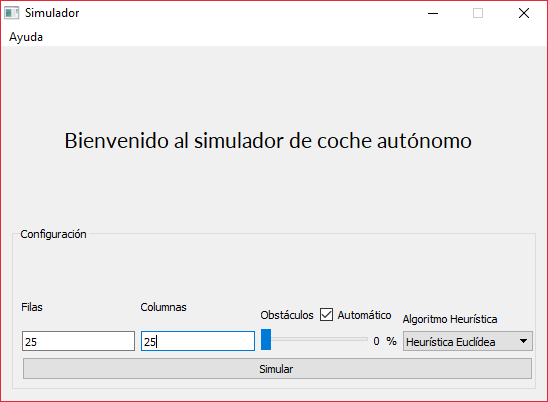

# A* Search Algorithm
Implementation of the A Star Search Algorithm in C++ and QT to find the shortest path between two positions.

## Index
* [About](#about)
* [Usage](#usage)
* [Authors](#authors)
* [License](#license)

## About

This program is an implementation of a shortest path algorithm (A*) using C++ and QT. The aim of this program is to find the
optimum path between two positions of our board. Besides, the board will have obstacles that the program has to avoid.

The real context of the program is a SmartCar that has to find the shortest path to arrive to the aim.

The context is represented by a MxN Matrix, filled with free and busy cells and a start and end position. 
The program will explore each free cell that can be in the path, following the order of the A* Search Algorithm.
This algorithm uses the evaluation function f(n) = g(n)+h'(n).

1.  g(n) represents the cost of the travelled way from the start point to the cell n. 
2.  h'(n) represents the heuristic value of the cell that has to be evaluated from the actual cell. The heuristic functions implemented in this program are Manhattan, Chebyshev y Euclídea.

## Usage

In order to use the program is neccesary to have QTCreator (https://www.qt.io/qt-features-libraries-apis-tools-and-ide/) installed. 

After opening and building the project in QT the following screen will appear.

In the initial screen you can set the properties of the Board, such as Rows and Column numbers, obstacles quantity and Heuristic Algorithm.

In the game screen the steps to follow will appear at the top. Besides there are options to exit or restart the game.

## Authors

* Alberto Jesús Gonzalez Álvarez
* Martín Belda Sosa
* Ángel Luis Igareta Herráiz

## License
The Mit License.